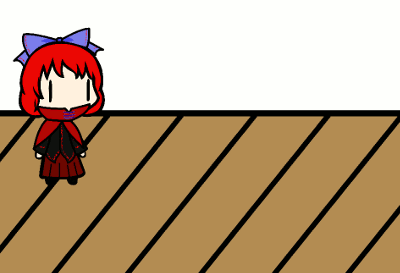
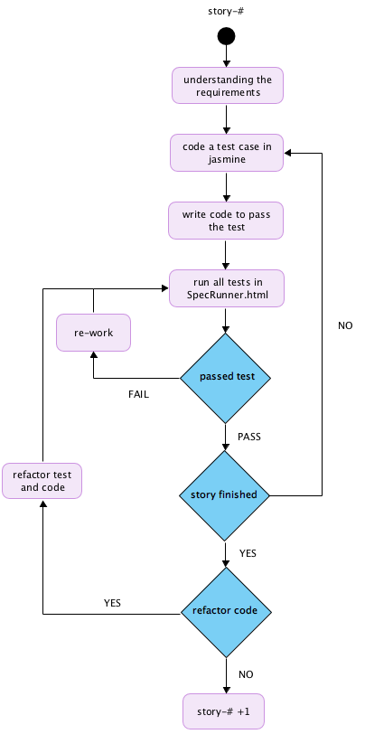
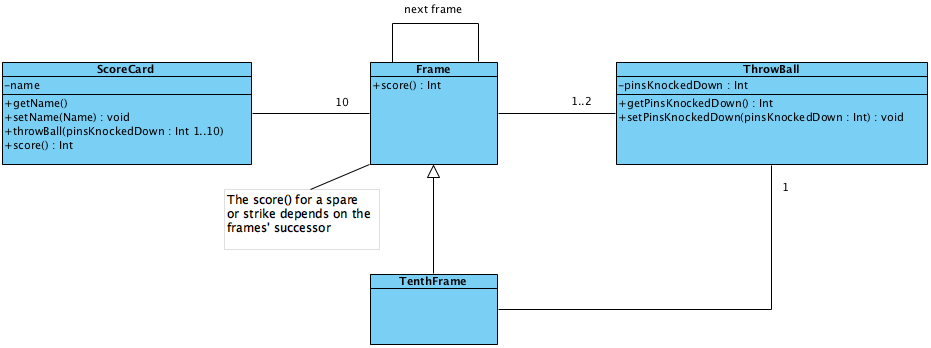

Bowling Challenge
=================



### [Makers Academy](https://makers.tech/) :: [Week 5/6 Weekend Challenge](https://github.com/makersacademy/bowling-challenge)


### Setup Instructions :

```
  + Fork this repo
  + Run ScoreCard.html to play
  + Run SpecRunner to see all tests
  + Enjoy! ¯\_(ツ)_/¯
```

### Task Constraints :

```
  + This is not a bowling game, it's a bowling scorecard simulator
  + The code base for this site is JavaScript
  + All TTD is done with Jasmine 3.1.0, located in the lib folder
  + Tests can be run by opening the SpecRunner.html file in a browser
  + Opening the ScoreCard.html file will run the simulator in a browser
  + All rolls will be manually inputted by the user, similar to in a real game
```
### Bowling Rules :

```
  + The game consists of 10 frames
  + In each frame, the player has 2 opportunities to knock down 10 pins
  + The score for the frame is the total number of pins knocked down
  + There are bonuses for ‘strikes’ [ x ] and ‘spares’ [ / ]
  + A spare is when the player knocks down all 10 pins within both allotted frame tries
  + The bonus for a spare is the number of pins knocked down on the next roll
  + A strike is when a player knocks down all 10 pins on the first try
  + The bonus for a strike is the value of the next 2 balls rolled
  + In the 10th frame, a player who rolls a spare or strike are allowed to roll …
    … the extra balls to complete the frame
  + No more than 3 balls can be rolled in the 10th frame
```
[Video Explanation](https://www.youtube.com/watch?v=aBe71sD8o8c)


### Sample ScoreCard


### Jasmine TDD Flow Chart :


### User Stories :

```
  As an avid bowler
  To show everyone my score in a ten pin bowling game
  I want to assign my name to my score card
```

```
  As an avid bowler
  To get the highest score possible
  I want to knock down as many pins …
    … as I can within two throws (a frame)
```

```
  As a Score Card computer
  To compute the score of a frame with pins left standing
  I want to add the total of pins not standing …
    … to the overall score
```

```
  As a Score Card computer
  To know when a game is over
  I must define a bowling game as consisting …
    … of 10 frames
```

```
  As a Score Card computer
  To keep track of the game score
  I must incrementally count the total …
    … score over 10 frames
```

```
  As a Score Card computer
  To computer the score of a frame
  I must recognise a 'strike' frame …
    … and apply the correct rules
```

```
  As a Score Card computer
  To compute the score of a frame
  I must recognise a 'spare' frame …
    … and apply the correct rules
```

```
  As a Score Card computer
  To computer the score of a frame
  I must recognise that a 'strike can …
    … be followed by a 'spare'
```

```
  As a Score Card computer
  To computer the score of a frame
  I must recognise that a 'strike can …
    … be followed by a 'strike'
```

```
  As a Score Card computer
  To computer the score of a frame
  I must recognise that no more than 3 …
    … balls can be rolled in the 10th frame
```


### Logic Diagram :


### UML Class Diagrams :

```
Initial Model
```


### Screen Mockup/Guide :


### Notes and Optional Extras :

In any order you like:

* Create a nice interactive animated interface with jQuery.
* Set up [Travis CI](https://travis-ci.org) to run your tests.
* Add [ESLint](http://eslint.org/) to your codebase and make your code conform.

You might even want to start with ESLint early on in your work — to help you
learn Javascript conventions as you go along.


### Code Review

In code review we'll be hoping to see:

* All tests passing
* The code is elegant: every class has a clear responsibility, methods are short etc.

Reviewers will potentially be using this [code review rubric](docs/review.md).  Note that referring to this rubric in advance may make the challenge somewhat easier.  You should be the judge of how much challenge you want.
